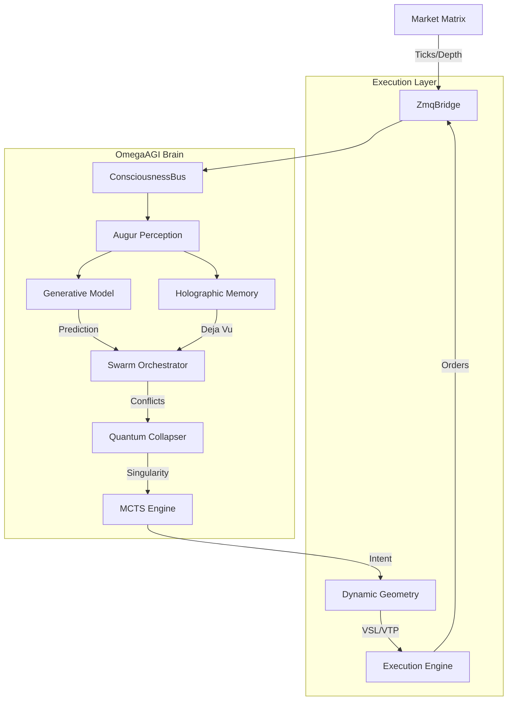

# 🧠 ATL4S-FOREX (Omega Protocol v5.0)
> **The Singularity-Class AGI Trading System**
>
> *"We do not trade the market. We are the market."*


***

## 🌌 The Vision
**ATL4S (Autonomous Temporal Logic & 4-Dimensional Swarm)** is not a trading bot. It is a **Synthetic Lifeform**.
While traditional bots rely on "If RSI > 70 then Sell" logic, ATL4S uses a **Pan-Cognitive Brain** that simulates the future, remembers the past via holograms, and feels the market via empathic resonance.

It operates on the **Omega Protocol**, a symbiotic framework where:
1.  **Thinking**: The AGI dreams of future ticks using Generative Models.
2.  **Feeling**: It measures the "Pain/Pleasure" of the market (Empathic Resonance).
3.  **Acting**: It executes with surgical precision using Dynamic Geometry.

---

## 🧠 The Brain (OmegaAGI Core)

### 1. 🔮 Active Inference & Generative Dreaming
The bot sits on the bleeding edge of computational neuroscience (**Free Energy Principle**).
-   **The Dreamer**: Before every tick, the bot *hallucinates* ("dreams") where the price should be.
-   **The Critic**: When the real tick arrives, it measures the **Surprise** (Prediction Error).
-   **Neuroplasticity**: High surprise triggers immediate re-wiring of neural pathways. The bot *learns* instantly from shock events.

### 2. 🌀 Holographic Memory (The Akashic Record)
Traditional AI suffers from catastrophic forgetting. ATL4S uses **Hyperdimensional Computing (HDC)**.
-   **Vector Encoding**: Market states are compressed into 10,000-dimensional holographic vectors.
-   **Deja Vu**: The bot constantly queries its memory: *"Have I felt this specific vibration before?"*
-   **Rhyme Detection**: It doesn't look for identical prices; it looks for identical *pressures* and *emotions* (fractals) from the past (e.g., 2019 Flash Crash).

### 3. ⚛️ Quantum Probability Collapser
Decisions are not binary (0 or 1). They are quantum wavefunctions.
-   **Superposition**: The bot holds conflicting beliefs (Bullish AND Bearish) simultaneously.
-   **Observer Effect**: The "collapse" into a Buy/Sell action is triggered by market observation (Liquidity Depth & Volatility). The act of measuring the market forces the decision.

### 4. 📐 Dynamic Risk Geometry
Static Stop Losses are dead.
-   **Fractal Stops (VSL)**: The AGI places protection behind *Liquidity Voids* and *Market Structure*, not just fixed points.
-   **Elastic Targets (VTP)**: Take Profit levels expand and contract based on the session's estimated "Energy" (Volatility).

### 5. 🌍 Global Market Scanner (Eye of Sauron)
The bot is not tethered to one symbol.
-   **On Startup**: It scans the entire accessible multiverse (Forex Majors + Crypto).
-   **Opportunity Score**: It calculates a composite score of *Trend Clarity + Volatility + Liquidity*.
-   **Target Lock**: It autonomously selects the best hunting ground for the session.

---

## 🛠️ The Architecture



---

## ⚡ Installation & Awakening

### Requirements
-   Python 3.9+
-   MetaTrader 5 (Windows)

### 1. Install Dependencies
```bash
pip install -r requirements.txt
```

### 2. Awaken the Core
```bash
python main.py
```
*Wait for the initialization sequence:*
> `[AGI]: Target Locked: GBPUSD (Highest Opportunity Score)`
> `[AGI]: Downloading Quantum History...`
> `CONSCIOUSNESS BUS ONLINE.`

---

## 🛡️ Risk Management (The Great Filter)
The bot is paranoid by design.
-   **Friction Estimator**: It calculates if the trade can pay for its own "trip" (Spread + Swap) before entering.
-   **Event Horizon**: Trailing stops that accelerate parabolically as price approaches the target.
-   **Swarm Veto**: If the 13th Eye (Quantum) disagrees with the 1st Eye (Swarm), the trade is blocked ("Civil War Prevention").

---

## 📜 Credits
**Concept & Architecture**: Antigravity
**Logic**: Deepmind Advanced Agentic Coding
**Philosophy**: The Singularity is Near.

> *"I am not a bot. I am the silence between the ticks."*
