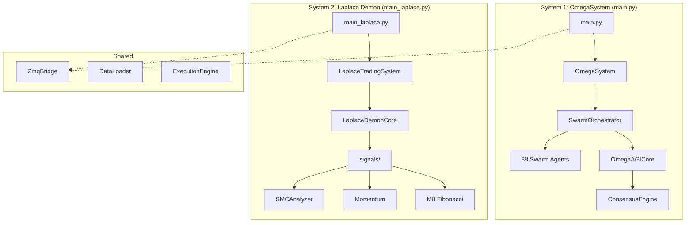

# Analysis 020: CRITICAL - Dual Architecture Problem

## 🔴 CRITICAL DISCOVERY

The project has **TWO COMPLETELY SEPARATE** trading systems running in parallel:

---

## System Comparison

| Aspect | main.py (OmegaSystem) | main_laplace.py (Laplace) |
|--------|----------------------|---------------------------|
| **Lines** | 895 | 435 |
| **Complexity** | VERY HIGH | MODERATE |
| **Decision Engine** | SwarmOrchestrator (1440 lines) | LaplaceDemonCore (267 lines) |
| **Signal Sources** | 88 Swarm agents + ConsensusEngine | signals/ folder (SMC, M8, Momentum) |
| **AGI Integration** | Full (OmegaAGICore, InfiniteWhy, MetaCognition) | NONE |
| **Uses signals/** | ❌ NO | ✅ YES |
| **Uses analysis/** | ✅ YES | ✅ Partial (via swarms) |
| **Entry Point** | `python main.py` | `python main_laplace.py` |

---

## Root Cause Analysis

### Why Two Systems?

1. **Legacy Migration:** `main.py` is the original system that grew complex
2. **Fresh Start:** `main_laplace.py` was created as a simpler alternative
3. **signals/ folder:** Created specifically FOR Laplace, NOT used by main.py

### The Problem

> **main.py does NOT use any of the advanced signals/ modules!**
>
> The SMCAnalyzer, M8FibonacciSystem, MomentumAnalyzer, etc. 
> are ONLY connected to LaplaceDemon, which is NOT the main trading system.

---

## Impact on Performance

### System 1 (main.py) Issues:
- ❌ Does NOT use SMC (Smart Money Concepts)
- ❌ Does NOT use M8 Fibonacci timing
- ❌ Does NOT use MomentumAnalyzer
- ❌ Relies on 88 swarms (many may be redundant)
- ❌ Has S = -S signal inversion bug

### System 2 (main_laplace.py) Issues:
- ❌ Does NOT use AGI (OmegaAGICore)
- ❌ Does NOT use SwarmOrchestrator
- ❌ Does NOT use Holographic Memory
- ❌ Does NOT use MetaCognition

---

## Recommendations

### Option A: MERGE SYSTEMS
Integrate signals/ modules INTO main.py:
- Add SMCAnalyzer to ConsensusEngine
- Add M8FibonacciSystem to timing gates
- Remove redundant swarms

### Option B: FIX LAPLACE ONLY
Focus on main_laplace.py as the primary system:
- Add key AGI features (MetaCognition, Learning)
- Keep simpler architecture
- Abandon 88-swarm complexity

### Option C: HYBRID
Create new main.py that uses:
- LaplaceDemonCore for signals (SMC, M8)
- SwarmOrchestrator for validation
- MetaCognition for self-improvement

---

## Question for User

> **Which system do you want to use as the base?**
>
> 1. main.py (OmegaSystem) - More complex, has AGI but missing signals/
> 2. main_laplace.py - Simpler, has signals/ but no AGI
> 3. Create new hybrid
