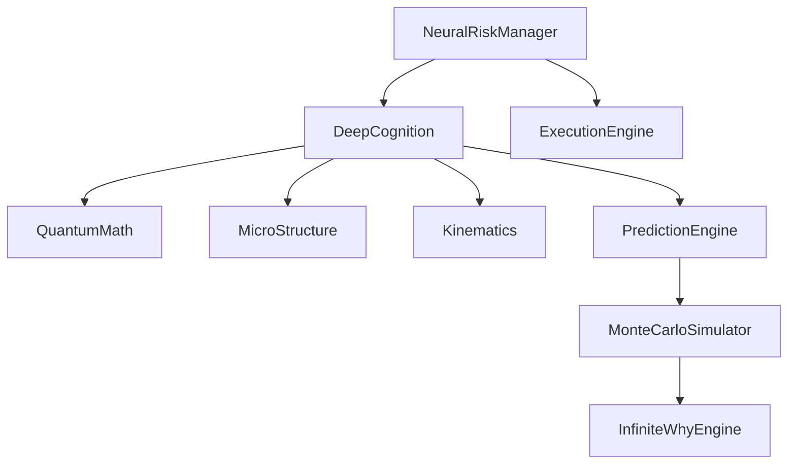

# Analysis 030: Core Analytical Modules Deep Dive

## 1. risk_neural.py (372 lines, 16KB)

**Class:** `NeuralRiskManager`

### Key Functions

| Function | Purpose |
|----------|---------|
| `calculate_position_size()` | Kelly + Circuit Breaker sizing |
| `get_geometric_stop()` | Physics-based SL (living stop) |
| `get_quantum_stop()` | Quantum barrier SL (deprecated) |
| `calculate_quantum_size()` | Full quantum position sizing |
| `check_margin_survival()` | Margin safety check |

### Notable Features
- Dynamic Kelly Criterion implementation
- "Living Stop Loss" based on market physics
- Energy/Coherence weighted position sizing
- Integration with wavelet and topology analysis

**Status:** ✅ Well integrated, used by main execution

---

## 2. deep_cognition.py (195 lines, 8KB)

**Class:** `DeepCognition`

### Architecture
```
DeepCognition
├── CortexMemory (experience storage)
├── MicroStructure (tick-level analysis)
├── QuantumMath (mathematical reality check)
├── Kinematics (physics engine)
├── PredictionEngine (oracle/monte carlo)
└── SeventhEye (synthesis sensor)
```

### Key Method: `consult_subconscious()`

Combines 6 weighted inputs:
- Trend Score (35%)
- SMC Score (20%)
- Pattern Score (15%)
- Volatility Score (10%)
- Micro Score (10%)
- Physics Score (10%)

### Features
- Adaptive Cognitive Weights (neuroplasticity)
- Chaos penalty (entropy-based)
- Kalman filter bias correction
- Super Confluence detection (3-brain agreement)

**Status:** ✅ Integrated, sophisticated neural layer

---

## 3. monte_carlo.py (295 lines, 11KB)

### Classes

| Class | Purpose |
|-------|---------|
| `MonteCarloSimulator` | Legacy basic simulation |
| `AGIMonteCarloSimulator` | Enhanced with InfiniteWhyEngine |

### AGI Monte Carlo Features
- Counterfactual scenario simulation
- Integration with InfiniteWhyEngine
- Thought branches from holographic memory
- Statistical summarization of all branches

### Key Methods
- `run()` - Basic Monte Carlo on PnL history
- `run_with_thought()` - AGI-enhanced with thought trees

**Status:** ✅ Integrated, used for risk assessment

---

## Integration Map



---

## Summary

| Module | Lines | Status | Complexity |
|--------|-------|--------|------------|
| risk_neural.py | 372 | ✅ OK | HIGH |
| deep_cognition.py | 195 | ✅ OK | HIGH |
| monte_carlo.py | 295 | ✅ OK | MEDIUM |
