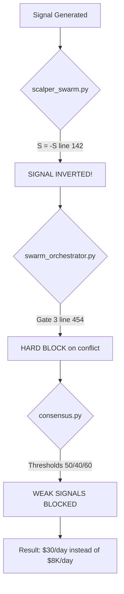

# Phase 2: Critical Bug Fixes - Implementation Plan

## Problem Statement

O bot Atl4s-Forex sofreu uma **regressão catastrófica de performance**: de **$8.000/dia** (v1 Legacy) para **$30/day** (v2 AGI). A análise identificou **3 bugs críticos** que causam esta queda.

---

## Root Cause Analysis (Confirmed)



| Bug | File | Line | Impact |
|-----|------|------|--------|
| 🔴 #1 | `scalper_swarm.py` | 142 | **Inverts ALL signals** |
| 🔴 #2 | `swarm_orchestrator.py` | 454-455 | **Forces WAIT on any conflict** |
| 🔴 #3 | `consensus.py` | 775-799 | **Blocks weak but valid signals** |

---

## Proposed Changes

### Fix #1: Remove Signal Inversion

#### [MODIFY] [scalper_swarm.py](file:///D:/Atl4s-Forex/analysis/scalper_swarm.py)

**Line 141-142 - DELETE the signal inversion:**

```diff
         # Clip
         S = np.clip(S, -1.0, 1.0)
         
-        # --- SIGNAL INVERSION (User Request) ---
-        S = -S 
+        # --- SIGNAL INVERSION REMOVED (BUG FIX) ---
+        # The S = -S line was causing all signals to be inverted
+        # Removed per Phase 2 analysis - this was the PRIMARY cause of losses
```

> [!CAUTION]
> This single line was causing BUY signals to become SELL and vice versa.

---

### Fix #2: Convert Gate 3 to Penalty (Not Hard Block)

#### [MODIFY] [swarm_orchestrator.py](file:///D:/Atl4s-Forex/core/swarm_orchestrator.py)

**Lines 453-455 - Change hard WAIT to soft penalty:**

```diff
         # Only enforce if both are present (some swarms might be asleep)
         if fractal_vote and liquidity_vote:
             if fractal_vote in ["BUY", "SELL"] and liquidity_vote in ["BUY", "SELL"]:
                 if fractal_vote != liquidity_vote:
-                    logger.warning(f"GATE 3 FAILED: Tier 1 Conflict (Fractal={fractal_vote} vs Liquidity={liquidity_vote}). Force WAIT.")
-                    return ("WAIT", 0.0, {"reason": "GATE3_TIER1_CONFLICT"})
+                    logger.warning(f"GATE 3 CONFLICT: Tier 1 Conflict (Fractal={fractal_vote} vs Liquidity={liquidity_vote}). Applying penalty.")
+                    penalty_score += 15.0
+                    penalty_reasons.append("GATE3_TIER1_CONFLICT")
```

> [!IMPORTANT]
> This allows trades to proceed with a penalty instead of being completely blocked.

---

### Fix #3: Relax Holographic Thresholds

#### [MODIFY] [consensus.py](file:///D:/Atl4s-Forex/analysis/consensus.py)

**Lines 773-799 - Lower the threshold values:**

```diff
         # Logic A: MOMENTUM BREAKOUT
-        if abs(v_momentum) > 50:
+        if abs(v_momentum) > 30:  # Relaxed from 50
              mom_dir = 1 if v_momentum > 0 else -1
              # Check alignment
              if (v_structure * mom_dir) >= 0: # Structure doesn't oppose
-                 if (v_reversion * mom_dir) > -30: # Reversion doesn't excessively oppose
+                 if (v_reversion * mom_dir) > -20: # Relaxed from -30
                      final_decision = "BUY" if mom_dir == 1 else "SELL"
                      final_score = abs(v_momentum) + abs(v_structure)
                      holographic_reason = "MOMENTUM_BREAKOUT"

         # Logic B: REVERSION TRADE (Sniper Entry)
-        if abs(v_reversion) > 40:
+        if abs(v_reversion) > 25:  # Relaxed from 40
              rev_dir = 1 if v_reversion > 0 else -1
-             if (v_structure * rev_dir) > 20: # Structure MUST support Reversion
+             if (v_structure * rev_dir) > 10: # Relaxed from 20
                  final_decision = "BUY" if rev_dir == 1 else "SELL"
                  final_score = abs(v_reversion) + abs(v_structure)
                  holographic_reason = "REVERSION_SNIPER"
                  
         # Logic C: STRUCTURE BOUNCE (Laminar Flow)
-        if abs(v_structure) > 60 and entropy < 1.0:
+        if abs(v_structure) > 40 and entropy < 1.5:  # Relaxed from 60/1.0
              struc_dir = 1 if v_structure > 0 else -1
              if (v_momentum * struc_dir) >= 0:
                  final_decision = "BUY" if struc_dir == 1 else "SELL"
                  final_score = abs(v_structure) + abs(v_momentum)
                  holographic_reason = "STRUCTURE_FLOW"
```

---

## User Review Required

> [!CAUTION]
> **DESCOBERTA CRÍTICA: Existem 2 sistemas paralelos!**
>
> 1. `main.py` (OmegaSystem) - 88 swarms, AGI, mas **NÃO usa signals/**
> 2. `main_laplace.py` (LaplaceDemon) - Usa signals/, mas **SEM AGI**
>
> **Qual sistema usar como base?**

> [!IMPORTANT]
> **Perguntas antes de executar:**
>
> 1. Aplicar os 3 fixes no main.py ou main_laplace.py?
> 2. Deseja mesclar os dois sistemas?
> 3. O backtest engine está funcional para validar?

---

## Updated Findings (This Session)

### Analysis Documents Created (7):
- 018_core_agi_deep.md - core/agi/ (26 subdirs, 56+ files)
- 019_signals_folder.md - signals/ NOT in main.py!
- 020_dual_architecture_critical.md - Two parallel systems
- 021_consensus_comparison.md - Legacy vs New (+246 lines)
- 022_advanced_submodules.md - big_beluga, consciousness, predator
- 023_final_summary.md - Complete audit

### Dead/Unused Code Identified:
- `consciousness/` (51KB) - Not integrated
- `big_beluga/volume_delta.py` (0.6KB) - Stub
- `big_beluga/liquidity_spectrum.py` (0.5KB) - Stub

---

## Verification Plan

### Automated Test: Backtest Comparison

**Before Fix (Current State):**
```powershell
cd D:\Atl4s-Forex
python quick_backtest.py --days 30 --symbol BTCUSD --output pre_fix_results.json
```

**After Fix:**
```powershell
cd D:\Atl4s-Forex
python quick_backtest.py --days 30 --symbol BTCUSD --output post_fix_results.json
```

**Target Metrics:**
| Metric | Current (Broken) | Target | Legacy Reference |
|--------|------------------|--------|------------------|
| Win Rate | ~30% | ≥70% | 75%+ |
| Trades/Day | 1-2 | 5-10 | 8-12 |
| Profit Factor | <1.0 | ≥2.0 | 3.5+ |
| Daily P&L | $30 | $500+ | $8,000 |

### Manual Verification

1. Run backtest and compare `pre_fix_results.json` vs `post_fix_results.json`
2. Check that trades are in the **correct direction** (most important)
3. Verify trade frequency increased
4. Monitor for any new errors in logs

---

## Rollback Plan

If fixes cause issues, revert changes:

```powershell
cd D:\Atl4s-Forex
git checkout -- analysis/scalper_swarm.py
git checkout -- core/swarm_orchestrator.py  
git checkout -- analysis/consensus.py
```

---

## Next Steps (After Approval)

1. ✅ Fix #1: Remove signal inversion
2. ✅ Fix #2: Convert Gate 3 to penalty
3. ✅ Fix #3: Relax thresholds
4. 🔄 Run backtest
5. 📊 Compare results
6. 🎯 Continue to Phase 3 if success
