# Phase 1: Comprehensive Project Analysis - Implementation Plan

## Problem Statement

O projeto Atl4s-Forex sofreu uma **regressão catastrófica de performance**: de **$8.000/dia** (v1 Legacy) para **$30/dia** (v2 AGI). Esta análise identificará as causas raízes e criará um roadmap de recuperação.

---

## Root Cause Hypothesis (Based on Initial Analysis)

### 🔴 Critical Finding: Decision Paralysis Through Over-Engineering

```mermaid
graph TD
    subgraph "Legacy v1 (Simple - $8K/day)"
        T1[Tick] --> A1[ConsensusEngine]
        A1 --> E1[3 Eyes Analysis]
        E1 --> X1[Direct Execution]
    end
    
    subgraph "New v2 (Complex - $30/day)"
        T2[Tick] --> AGI[OmegaAGICore]
        AGI --> MW[InfiniteWhyEngine]
        MW --> TT[ThoughtTree]
        TT --> MC[MetaCognition]
        MC --> SW[88 Swarms]
        SW --> VO[VetoSwarm]
        VO --> SF[Singularity Filter]
        SF --> X2[Maybe Execute...]
    end
```



| Metric | Legacy v1 | New v2 |
|--------|-----------|--------|
| **Main.py Lines** | 587 | 895+ |
| **Total Python Files** | ~52 | ~300+ |
| **Decision Layers** | 3 | 10+ |
| **Swarm Agents** | 1 (ScalpSwarm) | 88 (!!) |
| **Execution Latency** | ~10ms | ~500ms+ |
| **Daily P&L** | $8,000 | $30 |

---

## Analysis Approach: File-by-File Systematic Audit

### Priority 1: Execution Path (The Money Flow)

| File | Legacy Location | New Location | Priority |
|------|-----------------|--------------|----------|
| `main.py` | Root | Root | 🔴 CRITICAL |
| `bridge.py` | Root | `core/zmq_bridge.py` | 🔴 CRITICAL |
| `execution_engine.py` | N/A | `core/execution_engine.py` | 🔴 CRITICAL |
| `consensus.py` | `analysis/` | `analysis/` | 🔴 CRITICAL |

### Priority 2: Signal Generation (The Eyes)

| Eye | Legacy File | New File | Status |
|-----|-------------|----------|--------|
| **1st (Swarm)** | `analysis/scalper_swarm.py` (4.7KB) | `analysis/scalper_swarm.py` (13KB) | ⚠️ Bloated |
| **2nd (Sniper)** | `analysis/second_eye.py` (2.4KB) | `analysis/second_eye.py` (2.8KB) | ✅ Similar |
| **3rd (Hyper)** | `analysis/hyper_dimension.py` | N/A (moved?) | ❌ Missing? |
| **4th (Whale)** | `analysis/fourth_eye.py` (2.6KB) | `analysis/fourth_eye.py` (10KB) | ⚠️ Bloated |
| **5th-14th** | N/A | Various in `analysis/` | ❓ New - Audit |

### Priority 3: AGI Core (The Brain)

| Module | Size | Purpose | Status |
|--------|------|---------|--------|
| `omega_agi_core.py` | 56KB | Main AGI | ⚠️ Audit |
| `infinite_why_engine.py` | 46KB | Causal Reasoning | ⚠️ Audit |
| `thought_tree.py` | 35KB | Decision Trees | ⚠️ Audit |
| `swarm_orchestrator.py` | 71KB | 88 Swarm Control | 🔴 CRITICAL |
| `mcts_planner.py` | 15KB | Monte Carlo Tree Search | ⚠️ Audit |

---

## Proposed Changes

### Phase 1A: Critical Path Mapping

#### [ANALYZE] [main.py](file:///D:/Atl4s-Forex/main.py) vs [main.py](file:///D:/Atl4s-Forex/Atl4s_f0rex_secret-main/main.py)

**Objective:** Document exact differences in execution flow

1. Map tick ingestion path (both versions)
2. Map decision-making pipeline (both versions)  
3. Map execution command dispatch (both versions)
4. Identify where new version "loses" signals

#### [ANALYZE] [consensus.py](file:///D:/Atl4s-Forex/analysis/consensus.py)

**Objective:** Compare decision aggregation logic

- Legacy: 34KB, direct scoring
- New: 46KB, multi-layer abstraction
- Find what changed in score calculation

#### [ANALYZE] [scalper_swarm.py](file:///D:/Atl4s-Forex/analysis/scalper_swarm.py)

**Objective:** Understand bloat from 4.7KB → 13KB

- What was added?
- Is it helping or hurting?
- What conditions trigger execution?

---

### Phase 1B: Swarm Agent Audit

The new project has **88 swarm agents**. This is the most likely source of over-filtering.

#### Swarm Categories (Initial):

```
analysis/swarm/
├── Physics-Based (15 agents)
│   ├── schrodinger_swarm.py
│   ├── heisenberg_swarm.py
│   ├── hawking_swarm.py
│   ├── feynman_swarm.py
│   └── ...
├── Math-Based (12 agents)
│   ├── riemann_swarm.py
│   ├── godel_swarm.py
│   ├── laplace_swarm.py
│   └── ...
├── Strategy-Based (20 agents)
│   ├── sniper_swarm.py
│   ├── harvester_swarm.py
│   ├── apex_swarm.py
│   └── ...
└── Meta/Control (10 agents)
    ├── veto_swarm.py  ← 🔴 LIKELY CULPRIT
    ├── council_swarm.py
    └── ...
```

> [!WARNING]
> **O `veto_swarm.py` pode estar bloqueando a maioria das operações!**

---

### Phase 1C: Forgotten Code Recovery

Files in legacy that may not be properly integrated in new:

| Legacy File | Purpose | New Equivalent | Status |
|-------------|---------|----------------|--------|
| `src/macro_math.py` | Macro Analysis | ??? | ❓ Check |
| `src/quantum_math.py` | Quantum Calcs | `core/agi/quantum.py`? | ❓ Check |
| `src/markov_chain.py` | Probability | ??? | ❓ Check |
| `analysis/trade_manager.py` | Position Mgmt | `core/execution_engine.py`? | ❓ Check |

---

## Verification Plan

### Phase 1 Verification (Analysis-Only)

Since Phase 1 is purely analytical (no code changes), verification consists of:

1. **Structural Documentation**
   - Create complete file inventory with sizes, purposes, and health status
   - Generate dependency graph between modules

2. **Interview Tests** (Manual Verification)
   - For each critical module, answer:
     - What does it receive as input?
     - What does it produce as output?
     - What conditions trigger action vs inaction?

3. **Signal Flow Tracing**
   - Manually trace a hypothetical tick through both systems
   - Document where signals get blocked/filtered

### Future Backtest Verification (Phase 4)

After Phase 2-3 fixes, we will run:

```powershell
# Run quick backtest to verify fix
python quick_backtest.py --days 30 --verbose
```

**Target Metrics:**
- Win Rate: ≥ 70%
- Trades/Day: 5-10
- Profit Factor: ≥ 2.0

---

## User Review Required

> [!IMPORTANT]
> **Antes de prosseguir, preciso confirmar:**
>
> 1. **Você quer que eu analise CADA um dos 88 swarm agents?** Isso levará muito tempo, mas garantirá que nenhum código "morto" ou "burro" fique para trás.
>
> 2. **Qual é a prioridade:** Recuperar a performance do legacy primeiro (fix rápido) OU integrar tudo do AGI de forma correta (fix completo)?
>
> 3. **Há algum arquivo específico que você sabe que estava funcionando bem no legacy e agora não funciona?**

---

## Session Deliverables

Ao final desta sessão de análise, você terá:

1. ✅ `task.md` - Master task list com todas as fases
2. ✅ `implementation_plan.md` - Este documento
3. 🔄 **Próximo:** Análise detalhada da pasta `analysis/` começando por `consensus.py`

---

## Next Steps

### ✅ Completed
1. [x] Analisar `analysis/consensus.py` - **5 issues found**
2. [x] Analisar `analysis/scalper_swarm.py` - **🔴 CRITICAL: Signal inversion**
3. [x] Analisar `core/swarm_orchestrator.py` - **7 penalty layers**
4. [x] Identificar o "filtro assassino" - **Multiple: S=-S, Gate 3, thresholds**

### 🔄 In Progress
5. [ ] Analisar remaining 80+ swarm agents (if needed)
6. [ ] Criar plano específico para cada módulo problemático

### 📋 Critical Fixes Identified
- Remove `S = -S` in scalper_swarm.py (line 142)
- Convert Gate 3 from hard block to penalty (swarm_orchestrator.py line 454)
- Lower Holographic thresholds in consensus.py (50→30, 40→25, 60→40)

> [!TIP]
> See [findings_summary.md](file:///C:/Users/pichau/.gemini/antigravity/brain/e9c00237-c64a-443c-808a-8108cf0778b8/findings_summary.md) for complete analysis.

